# MAMMA MIA Challenge — Breast Tumour pCR Prediction

This project was developed as part of the **[MAMMA MIA Challenge](https://mamma-mia-challenge.grand-challenge.org/)**, an international medical imaging competition focused on predicting pathological complete response (pCR) to neoadjuvant chemotherapy (NAC) in breast cancer patients using DCE-MRI imaging and clinical data.

**Authors:** Kacper Janiszewski · Krzysztof Nosek · Róża Mazurek

---

## Clinical Background

Neoadjuvant chemotherapy (NAC) is administered before surgery to shrink breast tumours. A key outcome metric is **pathological Complete Response (pCR)**: whether any invasive cancer remains after treatment.

| Label | Meaning |
|-------|---------|
| `pCR = 1` | No invasive cancer after treatment — complete response |
| `pCR = 0` | Residual cancer still present |

Predicting pCR before or early in treatment allows clinicians to personalise therapy and avoid ineffective regimens. This project explores both imaging-based (3D deep learning on DCE-MRI) and tabular (clinical data) approaches to this prediction task.

---

## Dataset

The challenge dataset comprises:
- **1,506 breast cancer patients** from the ISPY2 and DUKE clinical cohorts
- **Multi-phase DCE-MRI** volumes — dynamic contrast-enhanced scans acquired at sequential time points after contrast injection
- **Expert tumour segmentations** (NIfTI `.nii.gz` format) for each patient
- **Clinical metadata** — demographics, tumour characteristics (ER/PR/HER2, grade), and NAC agent information

---

## Data Preparation

### 1. Image Preprocessing (`preprocessing/pcr_prediction_folders.py`)

For each patient:
1. Load all DCE-MRI phases and the expert segmentation mask
2. For DUKE cohort: crop to the breast containing the tumour (axial midline split)
3. Crop the full volume to a tight bounding box around the tumour + configurable margin
4. Optionally compute inter-phase difference channels to capture temporal contrast dynamics
5. Save cropped volumes as `.npy` arrays and write a `train.json` manifest

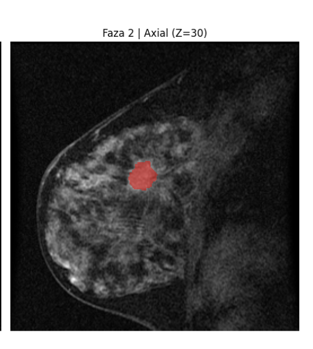

| Axis | Cropped volume |
|------|---------------|
| X | 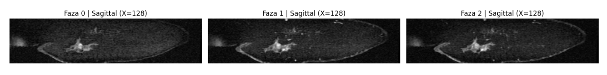 |
| Y | 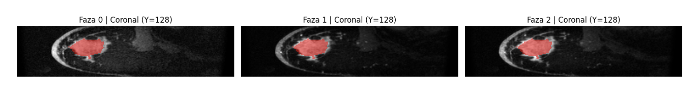 |
| Z | 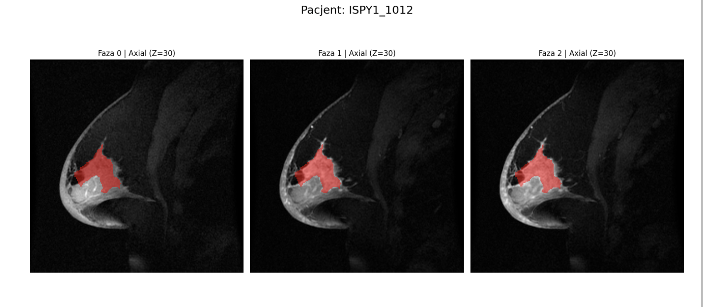 |

### 2. Nottingham TIC Features (`preprocessing/nothingam_scale.py`)

For each patient, we compute a **Time-Intensity Curve (TIC)** — how contrast signal intensity inside the tumour changes across MRI phases — for every voxel within the segmentation mask.

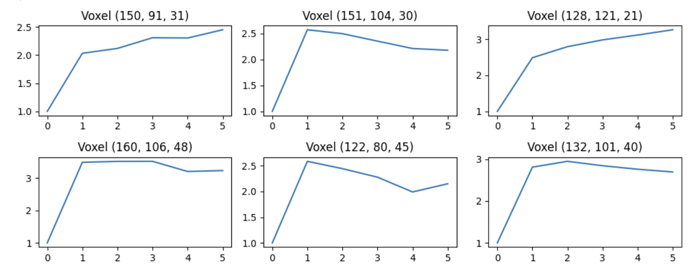

From each voxel's TIC we extract three features:

| Feature | Definition |
|---------|-----------|
| **Wash-in rate** | Speed of contrast uptake after injection |
| **Wash-out enhancement** | Change in intensity from peak to final phase |
| **Wash-out stability** | Linearity of the post-peak signal (RSS of linear fit) |

Wash-out enhancement determines the **Nottingham TIC type**:

| Type | Wash-out | Interpretation |
|------|---------|---------------|
| Type I | > 0.05 | Persistent — low-grade tumour |
| Type II | −0.05 to 0.05 | Plateau — intermediate |
| Type III | < −0.05 | Wash-out — high-grade, more likely pCR |

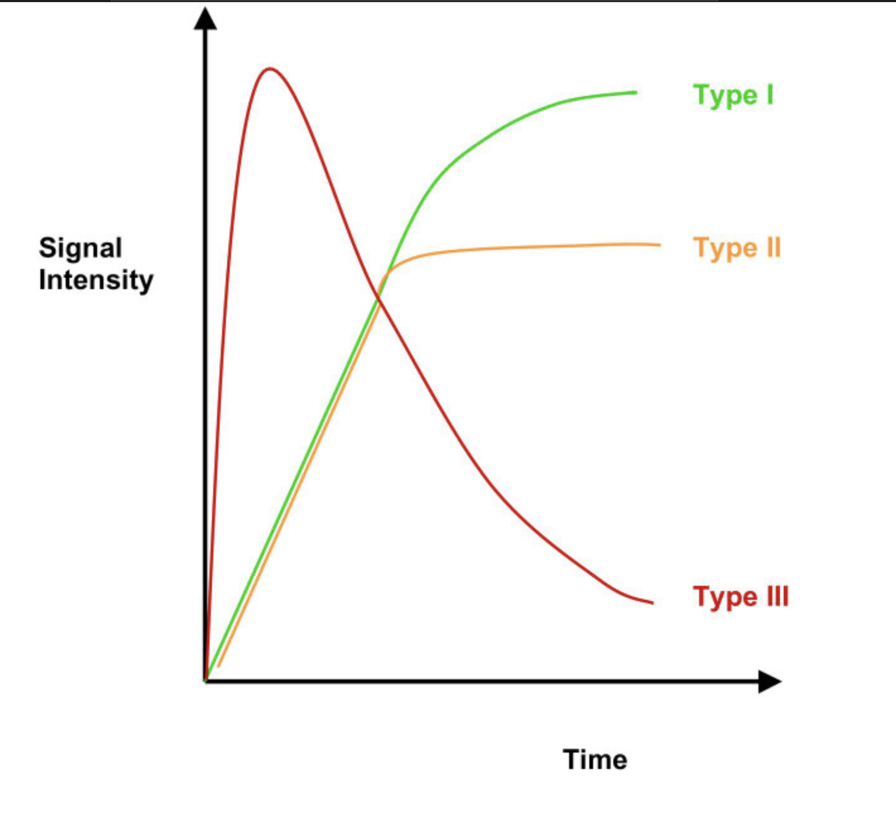

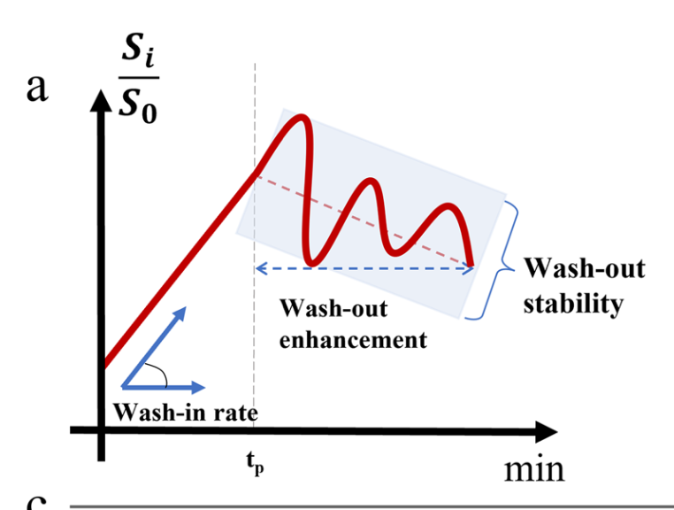

Per-patient aggregates (dominant type, average wash-in/out/stability, voxel counts per type) are saved to `data/nottingham_summary.csv`.

### 3. Clinical Feature Engineering

The clinical dataset had many missing Nottingham Grade values. We imputed them using image-derived dominant TIC types. All clinical features pass through a scikit-learn pipeline (`models/tabular/preprocessing_pipeline.py`) that handles:
- Column dropping (acquisition metadata, identifiers)
- Targeted imputation (median, constant, "unknown")
- NAC agent typo correction and binary encoding per drug substance
- One-hot encoding of categorical variables

---

## Models

### FusionPCRNet — Main Model (`models/fusion_pcr_net/`)

A multimodal architecture fusing 3D imaging features with voxel-level TIC statistics.

```
Input: 6-channel 3D volume (5 DCE-MRI phases + 1 mask), resized to 128×128×128

CNN Branch
  └─ Pre-trained R3D-18 (Kinetics400)
       └─ First conv adapted: 3 → 6 input channels
            (pretrained weights copied for ch 0-2, mean-initialised for ch 3-5)
       └─ SpatialAttention3D (CBAM-style) after layers 2, 3, 4
       └─ Global average pooling
       └─ Linear projection: 512 → 128
                                            ┐
TIC Branch (4 scalar features per patient)  │
  └─ FC: 4 → 32 → 64                        ├─ cat → 192
       (LayerNorm, no BatchNorm dependency)  │
                                            ┘
Fusion Head
  └─ Linear 192 → 128 → 2 (CrossEntropyLoss)
```

**Design decisions:**
- **CBAM spatial attention** on deeper ResNet layers to focus on tumour-relevant regions without modifying the stem
- **LayerNorm** (not BatchNorm) in the TIC branch — batch-size independent, stable with small batches
- **GroupNorm** in the projection head for the same reason
- Early ResNet layers frozen (`freeze_until="layer1"`) to preserve low-level Kinetics features while fine-tuning on limited medical data
- TIC features computed **before** intensity augmentation to avoid corrupting the physiological signal

---

### Simple3DCNN — Baseline (`models/simple_3d_cnn/`)

A lightweight 3D CNN without pretrained weights, used as a baseline.

```
Input: 11-channel volume (5 phases + 5 phase differences + 1 mask)

Conv3D(11→64)  + BN + ReLU + MaxPool3D
Conv3D(64→128) + BN + ReLU + MaxPool3D
Conv3D(128→256) + BN + ReLU + AdaptiveAvgPool3D(1)

Flatten → Linear(256→1024) → ReLU → Linear(1024→1) → Sigmoid
BCELoss
```

Variable-size input volumes are padded to a common shape via a custom `pad_collate` function.

---

### Hard Gating Mixture of Experts — Tabular (`models/tabular/hard_gating_moe_model.py`)

An ensemble of two tree-based experts controlled by a learned gating model, all trained on preprocessed clinical features.

```
Expert 1: XGBoost (hyperparameters tuned with Optuna — Trial 11)
  n_estimators=124, max_depth=3, lr=0.0411, subsample=0.978

Expert 2: RandomForest
  n_estimators=100

Gating model: LightGBM (also Optuna-tuned)
  Trained on labels: 1 = RF was correct and XGB was wrong, 0 = use XGB
  At inference: routes each sample to the expert predicted to be more accurate
```

---

### PCRNet — Tabular MLP (`models/tabular/pytorch_model_nottingham.py`)

A simple MLP baseline trained on the merged Nottingham TIC features + clinical data.

```
Input: numeric clinical features + nottingham_summary features

StandardScaler → Linear(d→64) → ReLU → Linear(64→32) → ReLU → Linear(32→1) → Sigmoid
BCELoss
```

---

## Project Structure

```
├── assets/                        # Figures and plots used in README
├── data/
│   ├── clinical_and_imaging_info.xlsx
│   ├── gtp_NCCN_based_filled_data_clinical_info.xlsx
│   └── nottingham_summary.csv     # Pre-computed TIC features (434 patients)
├── hpc_scripts/                   # SLURM job scripts used on HPC cluster
├── models/
│   ├── fusion_pcr_net/            # FusionPCRNet (primary deep model)
│   │   ├── model.py
│   │   ├── dataset.py
│   │   └── train.py
│   ├── simple_3d_cnn/             # Baseline 3D CNN
│   │   ├── dataset_mamma_mia.py
│   │   └── 3d_train_cnn.py
│   └── tabular/                   # Tabular models
│       ├── preprocessing_pipeline.py
│       ├── hard_gating_moe_model.py
│       └── pytorch_model_nottingham.py
├── notebooks/
│   └── viz.ipynb                  # Visualisation of pipeline steps and TIC curves
├── preprocessing/
│   ├── pcr_prediction_folders.py  # Crop and organise raw NIfTI volumes
│   └── nothingam_scale.py         # Compute Nottingham TIC features
├── requirements.txt
└── README.md
```

---

## Setup

```bash
pip install -r requirements.txt
```

All scripts are run from the **project root**:

```bash
# Step 1 — preprocess raw DCE-MRI images
python preprocessing/pcr_prediction_folders.py --data-root data

# Step 2 — compute Nottingham TIC features
python preprocessing/nothingam_scale.py --data-root data --output-csv data/nottingham_summary.csv

# Step 3a — train main model (FusionPCRNet)
python models/fusion_pcr_net/train.py --data-root data --epochs 50

# Step 3b — train baseline 3D CNN
python models/simple_3d_cnn/3d_train_cnn.py --data-root data

# Step 3c — train tabular MoE
python models/tabular/hard_gating_moe_model.py --clinical-xlsx data/gtp_NCCN_based_filled_data_clinical_info.xlsx

# Step 3d — train tabular MLP on TIC features
python models/tabular/pytorch_model_nottingham.py
```

---

## Statistics

Distribution of TIC types and Nottingham grades across patients:

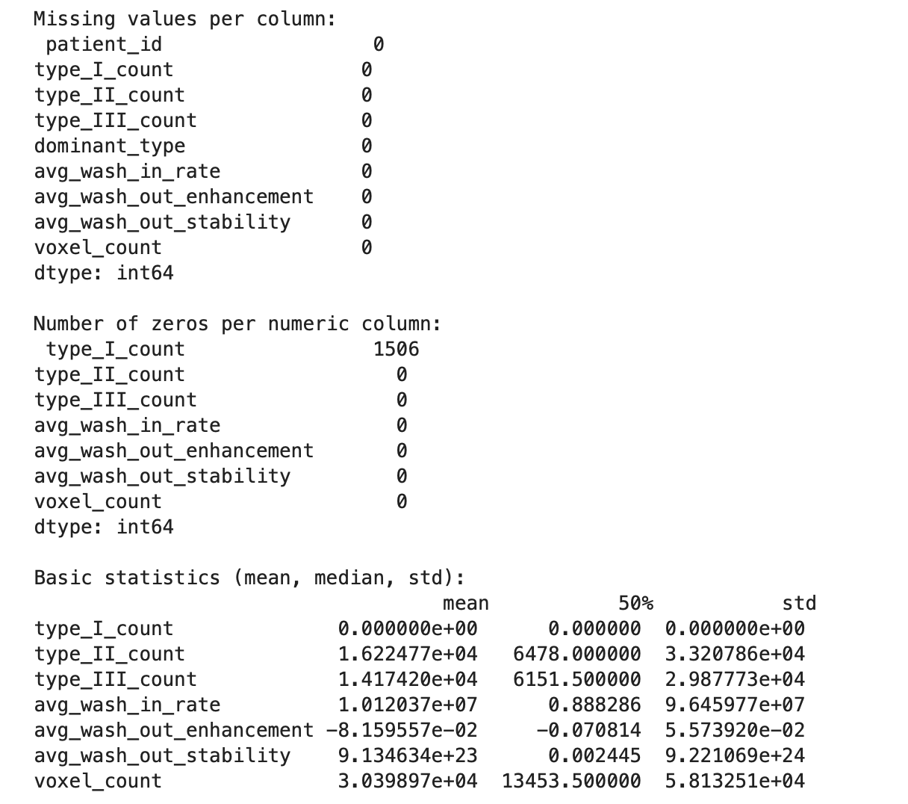

Scatter plot — wash-in rate vs wash-out enhancement:

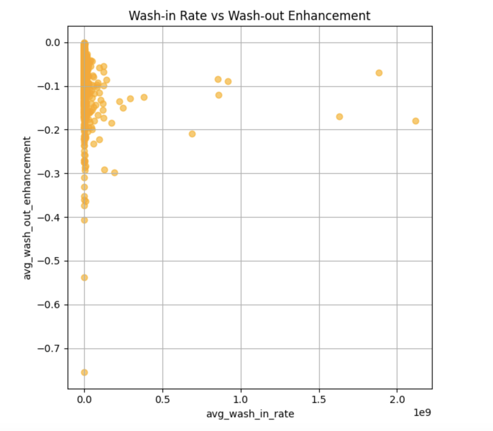

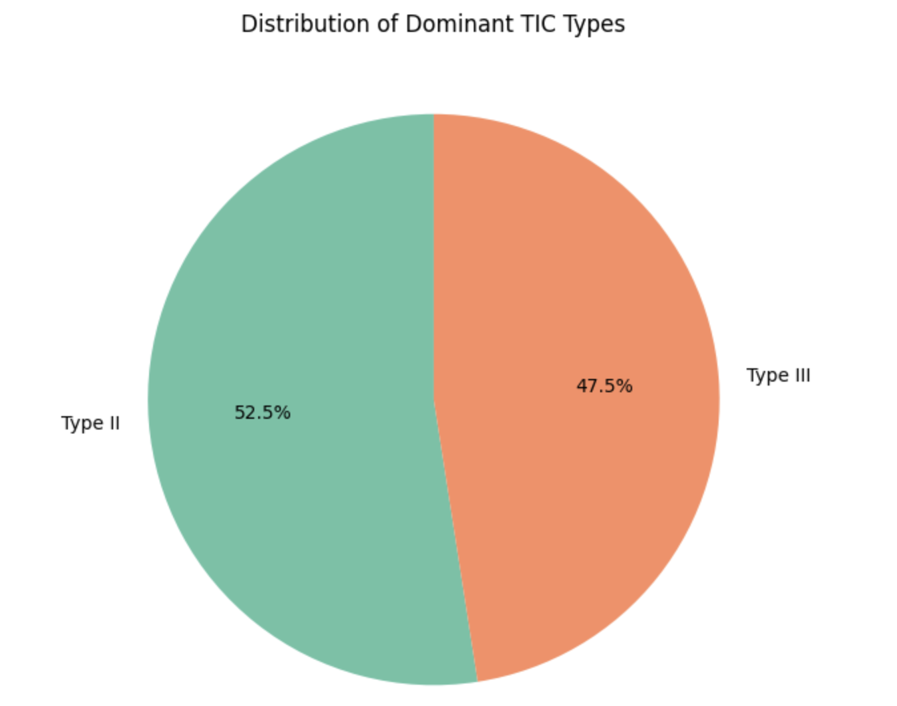

Sample clinical data:

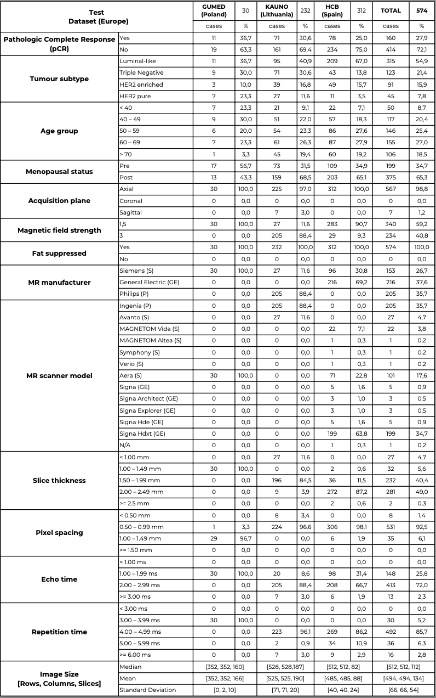
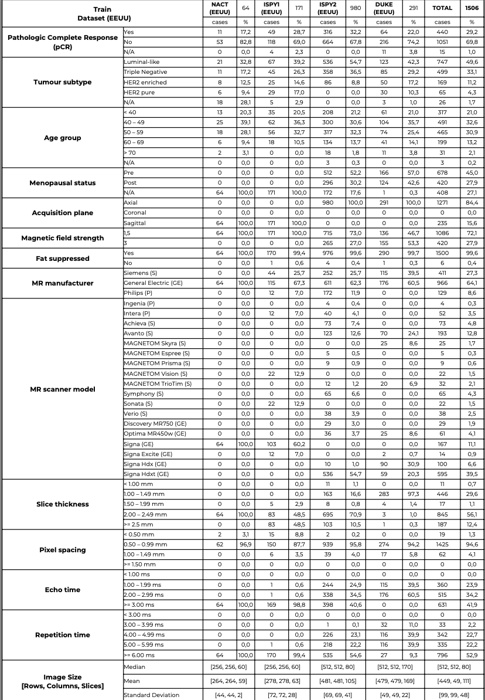

---

## Technologies

| Library | Purpose |
|---------|---------|
| PyTorch + torchvision | Deep learning models, R3D-18 backbone |
| nibabel | Medical image I/O (`.nii.gz`) |
| scikit-learn | Preprocessing pipeline, metrics |
| XGBoost / LightGBM | Tabular expert models |
| pandas / numpy | Data manipulation |
| Optuna | Hyperparameter optimisation (MoE gating) |
# Mamma-Mia-Challenge

